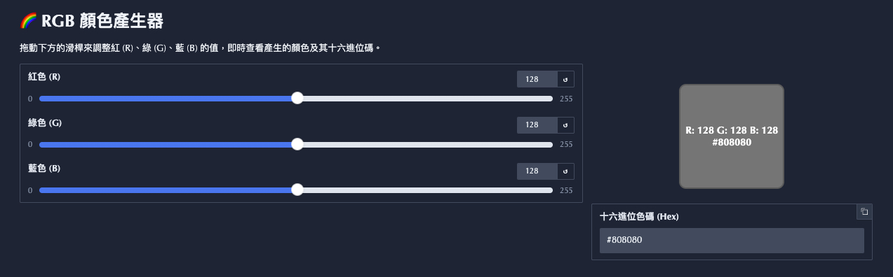

# Gradio Demo (RGB Color Generator)



## Run locally

Build

```bash
docker build -t rgb-color-generator .
```

Start container

```bash
docker run d -p 7860:7860 --name my-color-app rgb-color-generator
```

Access

http://localhost:7860

Stop container

```bash
docker stop my-color-app
```

Remove container

```bash
docker rm my-color-app
```

## Kubernetes YAML

Assume push the iamge to Google Artifact Registry(us-central1).

Copy the `k8s/deployment.yaml.tmpl` to `k8s/deployment.yaml`, and replace the placeholder:
- `$PROJECT_ID`
- `$AR_REPO_NAME`

Apply to GKE

```bash
kubectl apply -f k8s/deployment.yaml
kubectl apply -f k8s/service.yaml
```

Wait the external IP ready

```bash
kubectl get service color-generator-external
```

Access the external IP in browser.
